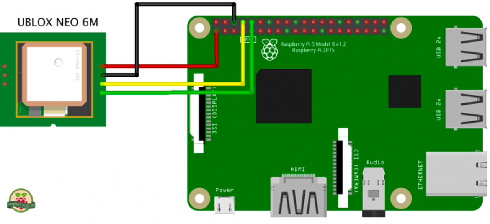
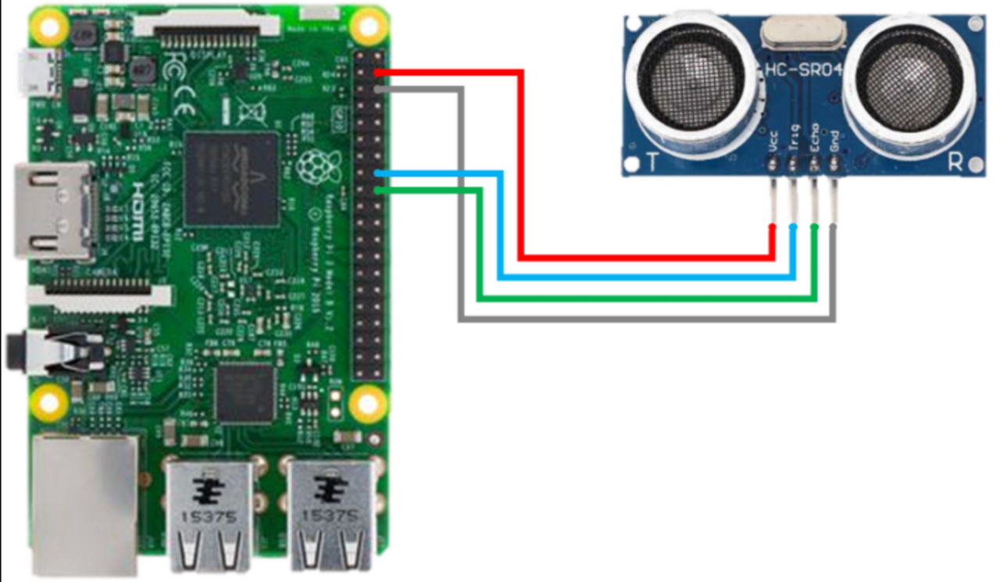

## Raspberry Pi

### Raspberry Pi

---

### Raspberry Pi neo-6m

1. Connecting Schema



1. Install the Dependencies

- pip installed

```python
sudo apt-get install python-pip
```

- pynmea2

```python
sudo pip install pynmea2
```

- GPS software

```python
sudo apt-get install gpsd gpsd-clients python-gps minicom
```

1. Configurate the services

- Serial port modify cmdline.txt:

```python
sudo nano /boot/cmdline.txt
```

replace

```python
dwc_otg.lpm_enable=0 console=tty1 root=/dev/mmcblk0p2 rootfstype=ext4 elevator=deadline fsck.repair=yes rootwait quiet splash plymouth.ignore-serial-consoles
```

- Change startup settings:

```python
dtparam=spi=on
dtoverlay=pi3-disable-bt
core_freq=250
enable_uart=1
force_turbo=1
init_uart_baud=9600
```

add the following lines end

```python
dtparam=spi=on
dtoverlay=pi3-disable-bt
core_freq=250
enable_uart=1
force_turbo=1
init_uart_baud=9600
```

- reboot the system

```python
sudo reboot now
```

- Configure the module for the 9600 rate:

```python
stty -F /dev/ttyAMA0 9600
```

- Connect AMA0 th the GPS Software First kill the process and add the device to gpsd tool

```python
sudo killall gpsd
sudo nano /etc/default/gpsd
```

Edit the file /etc/default/gpsd and add your serial port in DEVICES, like

```python
DEVICES="/dev/ttyAMA0"
```

- Restart the Software

```python
sudo systemctl enable gpsd.socket
sudo systemctl start gpsd.socket
sudo cgps -s
```

1. Run the Example

```python
cgps -s
```

- `referenced :` https://github.com/FranzTscharf/Python-NEO-6M-GPS-Raspberry-Pi/blob/master/readme.md

```python
import serial
import pynmea2

def read_gps_data():
    port = "/dev/ttyAMA0"
    baud_rate = 9600
    ser = serial.Serial(port, baud_rate, timeout=0.5)
    try:
        while True:
            data = ser.readline().decode("utf-8")
            if data.startswith("$GPGGA"):
                msg = pynmea2.parse(data)
                latitude = msg.latitude
                longitude = msg.longitude
                altitude = msg.altitude
                print(f"Latitude: {latitude}, Longitude: {longitude}, Altitude: {altitude} meters")
    except KeyboardInterrupt:
        ser.close()
        print("GPS reading stopped.")

if __name__ == "__main__":
    read_gps_data()
```

---

### Raspberry Pi Hc-sr04



```python
import RPi.GPIO as GPIO
import paho.mqtt.client as mqtt
import json
import time
import serial
import pynmea2

broker_address = "220.69.222.136"
broker_port = 1883
client_id = ""

def on_connect(client, userdata, flags, rc):
    print("Connected with result code " + str(rc))
    client.subscribe("test_topic/log")

def on_message(client, userdata, msg):
    print(msg.topic + " " + str(msg.payload))

GPIO.setmode(GPIO.BCM)
GPIO.setwarnings(False)
TRIG = 3
ECHO = 17

def send_result(port, baudrate=9600, timeout=1):
    ser = serial.Serial(port, baudrate, timeout=timeout)
    GPIO.setup(TRIG, GPIO.OUT)
    GPIO.setup(ECHO, GPIO.IN)

    GPIO.output(TRIG, False)

    try:
        while True:
            # micro
            GPIO.output(TRIG, True)
            time.sleep(1)
            GPIO.output(TRIG, False)

            while GPIO.input(ECHO) == 0:
                start = time.time()

            while GPIO.input(ECHO) == 1:
                stop = time.time()

            check_time = stop - start
            distance = check_time * 34300 / 2

            #neo-6m
            data = ser.readline().decode('utf-8')  # GPS 모듈로부터 데이터 읽기
            if data.startswith('$GPGGA'):  # GGA 문장 필터링
                msg = pynmea2.parse(data)
                latitude = msg.latitude  # 위도
                longitude = msg.longitude  # 경
                print("Distance : %.1f cm" % distance)
                print(data)
                client.publish("test_topic", json.dumps({"message":"7F10011001202023072113125700%.8f%.7f09500001%1.f007E"%(latitude,longitude,distance) }))
                time.sleep(1)
    except serial.SerialException as e:
            print(f"Error: {e}")
    except pynmea2.ParseError as e:
            print(f"Error parsing GPS data: {e}")

    except KeyboardInterrupt:
        print("complete")
        GPIO.cleanup()

client = mqtt.Client(client_id)
client.on_connect = on_connect
client.on_message = on_message

client.connect(broker_address, broker_port, 60)

client.loop_start()

if __name__ == "__main__":
    serial_port = '/dev/serial0'  # 사용하는 시리얼 포트 이름 입력
    send_result(serial_port)
```
